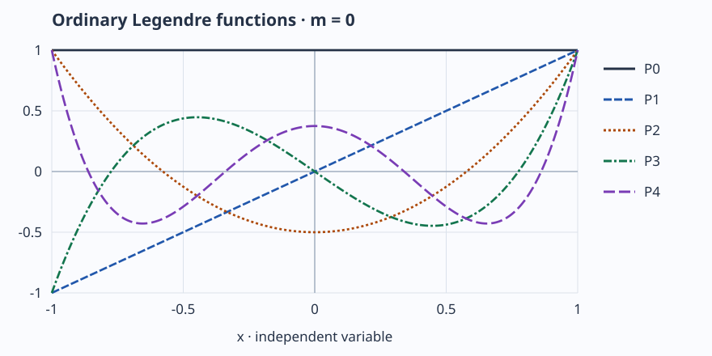

# Mathematical notation

These equations restate established contracts. TeX in the source becomes native
MathML at website build time; there is no external equation-rendering service.

## Vectors and row matrices

For $\mathbf{v}=(v_x,v_y,v_z)$, the Euclidean norm is

$$
\lVert\mathbf{v}\rVert=\sqrt{v_x^2+v_y^2+v_z^2}.
$$

This defines the mathematics, not the floating-point algorithm: gem uses stable
hypot-style lengths and scaled normalization. See [numerical accuracy](../tutorials/numerical.md).

A homogeneous translation with row-vector inputs is

$$
T=\begin{pmatrix}1&0&0&0\\0&1&0&0\\0&0&1&0\\t_x&t_y&t_z&1\end{pmatrix},\qquad
\mathbf{p}'=\mathbf{p}T.
$$

Thus $[x,y,z,1]T=[x+t_x,y+t_y,z+t_z,1]$. Directions use w=0.
The Matrix wrapper expression `T * p` evaluates this row product. A*B applies
A before B. [Transformation tutorial](../tutorials/transformations.md).

## Quaternions

A unit axis $\mathbf{u}$ and angle $\theta$ define

$$
q=\left[\cos(\theta/2),\,\mathbf{u}\sin(\theta/2)\right],\qquad
[0,\mathbf{v}']=q[0,\mathbf{v}]q^*.
$$

Storage is [w,x,y,z], and products use Hamilton multiplication. API units remain
function-specific; `quat_from_axis_angle` takes degrees.
[Quaternion reference](../api/quaternion.md).

For unit endpoints, shortest-path SLERP weights a spherical angle $\Omega$:

$$
S(q_0,q_1,t)=\frac{\sin((1-t)\Omega)}{\sin\Omega}q_0+
\frac{\sin(t\Omega)}{\sin\Omega}q_1.
$$

Signs are selected before interpolation. The implementation uses difference/sum
norms to resolve tiny angles, preserves endpoints and uses a continuous limit for
subnormal angles. The equation states the ideal calculation, rather than an
instruction to divide by zero for identical rotations.
[Inspect the interpolation frames](../examples/gallery/quaternions.md).

## Bezier curves and subdivision

Quadratic and cubic curves use the Bernstein weights:

$$
B_2(t)=(1-t)^2p_0+2(1-t)tp_1+t^2p_2,
$$

$$
B_3(t)=(1-t)^3p_0+3(1-t)^2tp_1+3(1-t)t^2p_2+t^3p_3.
$$

De Casteljau midpoint subdivision builds intermediate controls by repeated
averaging. It preserves the curve while dividing its parameter interval in two.
Adaptive sampling checks control distance to the endpoint segment and caps depth
at 16; it may exhaust that depth before meeting the requested flatness.
Equal parameter steps do not imply equal traveled distance.
[Inspect the control polygons and samples](../examples/gallery/bezier.md) and
[derive a local tangent in the tutorial](../tutorials/bezier.md).

## Legendre functions

Ordinary functions start with $P_0(x)=1$ and $P_1(x)=x$:

$$
lP_l(x)=(2l-1)xP_{l-1}(x)-(l-1)P_{l-2}(x).
$$

The associated functions retain the Condon–Shortley phase:

$$
P_m^m(x)=(-1)^m(2m-1)!!(1-x^2)^{m/2}.
$$

[](../assets/diagrams/legendre.svg)

Even degrees are even functions; odd degrees are odd functions. Every ordinary
curve reaches 1 at x=1, with P_l(-1)=(-1)^l. These functions are **unnormalized**;
the SH basis supplies its own normalization. Associated inputs require x in
[-1,1], while ordinary functions permit extrapolation with documented numerical
limits. [Legendre contracts](../api/legendre.md).
The [plot source](../../tools/site/legendre_diagram.py) evaluates the core API and
checks independent analytical values before writing this SVG.
[Open the plot at full size](../assets/diagrams/legendre.svg) to zoom into labels
on a small screen.

## Spherical harmonics

Canonical coefficient index is $i=l(l+1)+m$. For canonical real orthonormal basis
functions, reconstruction and active rotation obey

$$
f(\mathbf{d})=\sum_{l=0}^{2}\sum_{m=-l}^{l}c_{lm}Y_{lm}(\mathbf{d}),\qquad
f_R(\mathbf{d})=f(R^{-1}\mathbf{d}).
$$

Condon–Shortley signs are retained. The first-order XYZ functions are
$Y_{1,-1}=-\sqrt{3/(4\pi)}y$, $Y_{1,0}=\sqrt{3/(4\pi)}z$,
and $Y_{1,1}=-\sqrt{3/(4\pi)}x$. Coefficients may be RGB.
Cosine convolution applies band factors $\pi$, $2\pi/3$, $\pi/4$ exactly once for
L0,L1,L2; reflected Lambertian radiance is $L_o=\rho E/\pi$.
[Lighting tutorial](../tutorials/lighting.md).

```python
import math
from gem.quaternion import quat_from_axis_angle, quat_rotate_vector
from gem.vector import Vector
q = quat_from_axis_angle([0, 0, 1], 90)
v = quat_rotate_vector(q, Vector(3, [1, 0, 0]))
assert math.isclose(v.vector[1], 1.0, abs_tol=1e-12)
```

The adjacent Python block follows the same active +Z convention. Equations,
code and [verified diagrams](../examples/index.md) describe the same mathematics.
