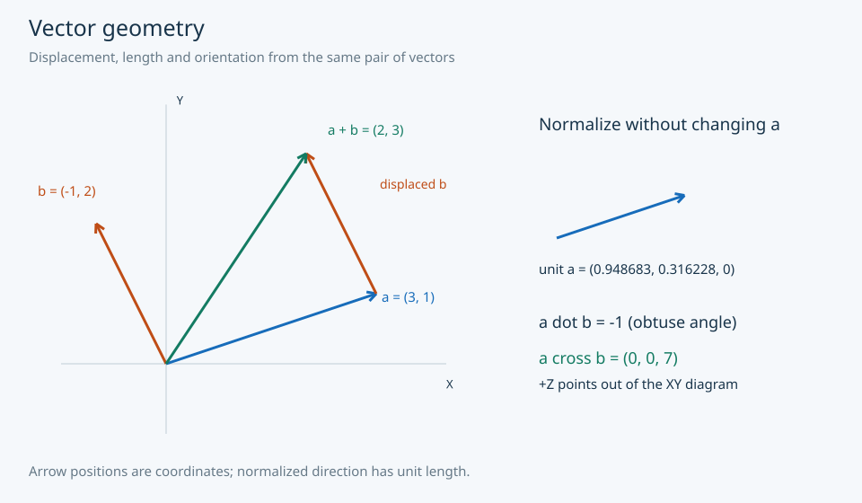
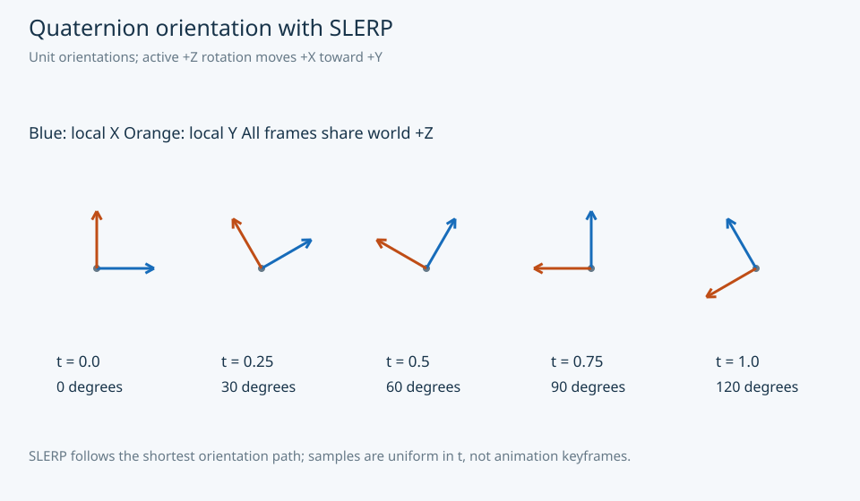
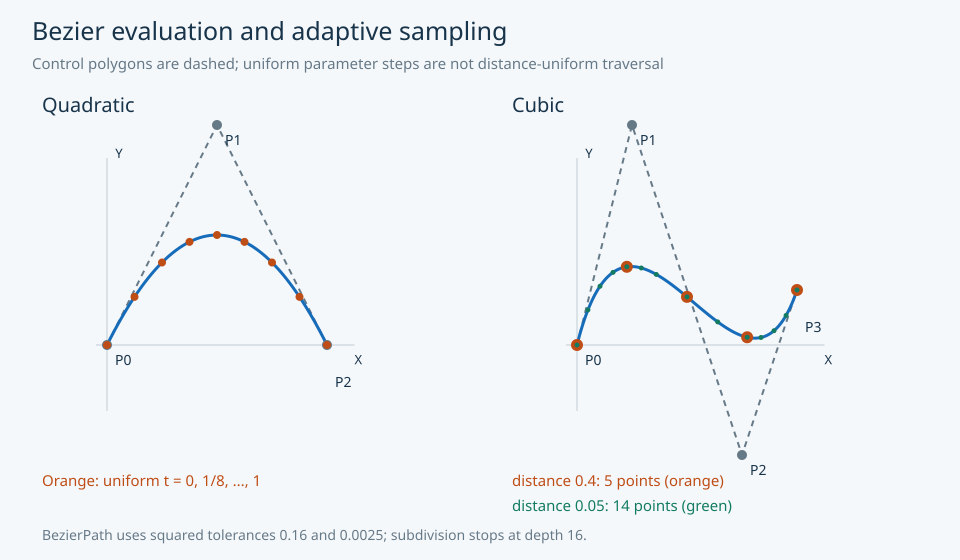

# Graphics mathematics gallery

These headless examples turn supported gem operations into inspectable geometry
and lighting. All inputs are generated in code. SVG diagrams use consistent
colors: blue for primary geometry, orange for a second operation, green for a
result or finer sampling. Each page explains the coordinate convention and the
independent numerical reference.

| Visual | What to inspect | Executable source |
| --- | --- | --- |
| [Vector geometry](gallery/vectors.md) | Addition as displacement, unit direction, dot and cross orientation | [scenes.py](../../examples/showcase/scenes.py) |
| [Transformation order](gallery/transforms.md) | Scale, rotation, translation and noncommuting order | [scenes.py](../../examples/showcase/scenes.py) |
| [Quaternion orientation](gallery/quaternions.md) | Five SLERP coordinate frames | [scenes.py](../../examples/showcase/scenes.py) |
| [Bezier sampling](gallery/bezier.md) | Control polygons, uniform t and adaptive tolerances | [scenes.py](../../examples/showcase/scenes.py) |
| [SH environment lighting](gallery/lighting.md) | Same diffuse sphere under original and rotated HDR lighting | [HDR renderer](../../examples/hdr_sh/visualize.py) |









## Regenerate and verify

```sh
python -m examples.showcase.regenerate
python -m examples.showcase.regenerate --verify
python -m examples.hdr_sh.regenerate --output-dir /tmp/gem-gallery-hdr
```

The SVG command requires only Python and gem's existing six dependency. No
external images or fonts are fetched. HDR output is generated separately to a
scratch directory so the canonical reference remains unchanged. The
[asset manifest](ASSET-MANIFEST.md) names all inputs, outputs, dimensions and
acceptance checks. See [verification](verification.md) for executed results and
[example instructions](../../examples/showcase/README.md) for isolated wheel use.

These are CPU reference calculations and diagrams. They do not create an OpenGL
context or render through a GPU shader. No new core mathematical APIs are added.
Continue with the [tutorials](../tutorials/index.md), [API reference](../api/index.md)
or [documentation index](../README.md).
