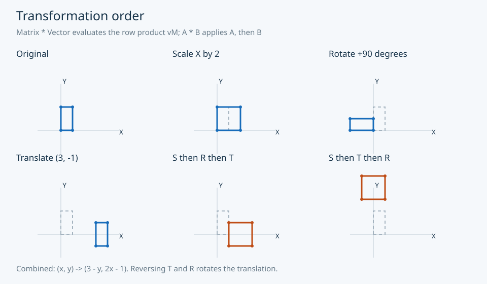
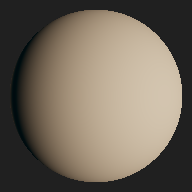
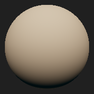

# Graphics mathematics, in Python

gem is a lightweight, pure-Python library for graphics and computational
mathematics. It makes vectors, matrices, quaternions, curves and lighting
calculations available without a numerical framework or native backend. The only
runtime dependency is six; standard-library ctypes exports support graphics integration.

[Install development code](getting-started/installation.md) ·
[Run the quick start](getting-started/quick-start.md) ·
[Browse the API](api/index.md) ·
[Explore visual examples](examples/index.md)

*Scale, rotation and translation evaluated by gem's actual Matrix APIs. Dashed
shapes are original; solid shapes are transformed. [Regenerate the SVGs](../examples/showcase/README.md).*

## A practical mathematical core

| Area | Implemented functionality | Begin with |
| --- | --- | --- |
| Algebra | Vector arithmetic, dot/cross products, stable norms; matrix products/inverses; Hamilton quaternion algebra | [Vectors](tutorials/vectors.md), [API](api/index.md) |
| Graphics transforms | Row-vector composition, rotation, scale, translation, shear, perspective/orthographic projection | [Transforms](tutorials/transformations.md), [cameras](tutorials/camera.md) |
| Curves and geometry | Quadratic/cubic Bezier evaluation and adaptive sampling; Plane/Ray representations and rigid transforms | [Curves](tutorials/bezier.md), [geometry](tutorials/geometry.md) |
| Lighting functions | Legendre functions, real SH projection/reconstruction, diffuse convolution and analytical L2 rotation | [Lighting tutorial](tutorials/lighting.md), [SH API](api/spherical-harmonics.md) |

Use gem for learning, graphics tools, reference calculations and applications that
benefit from readable Python mathematics. It is not a renderer, visibility tracer,
physics engine or array-processing backend. Public contracts document numerical
limits and ownership rather than hiding those details behind framework conventions.

*Same CPU-reconstructed diffuse sphere, original lighting and analytical +90° Z
rotation. The verified [HDR workflow](../examples/hdr_sh/README.md) supplies matching
Python and GLSL reference coefficients; these images do not come from a GPU renderer.*

## Know the conventions

Matrices use row-major nested lists and row-vector mathematics. The wrapper syntax
`M * v` computes the row product vM; A*B applies A then B. Quaternions store
[w,x,y,z]. Constructors can retain caller storage; returning and in-place methods
have documented ownership boundaries. Read [mathematical conventions](architecture/conventions.md),
[notation](architecture/notation.md) and [compatibility](architecture/compatibility.md)
before integrating with another graphics API.

## Development status

The package metadata still declares v0.1.12. The historical PyPI release does not
contain the audited modernizations. Install from the current repository for these
examples; 1.0 is not released and no new PyPI release is claimed. Correctness,
performance and documentation work have established the current foundation;
release engineering and the interpreter/platform policy still require review.

The [canonical roadmap](../ROADMAP.md) separates 1.0 preparation, proposed 1.x
expansion and long-term 2.0 direction. Planned features and future language ports
are not implemented APIs or dated commitments. See [release information](development/releases.md),
[contributing](development/contributing.md) and [verification](development/website-verification.md).

Created by Alex Marinescu. Source and examples use the existing
[BSD 2-Clause license](../LICENSE).
